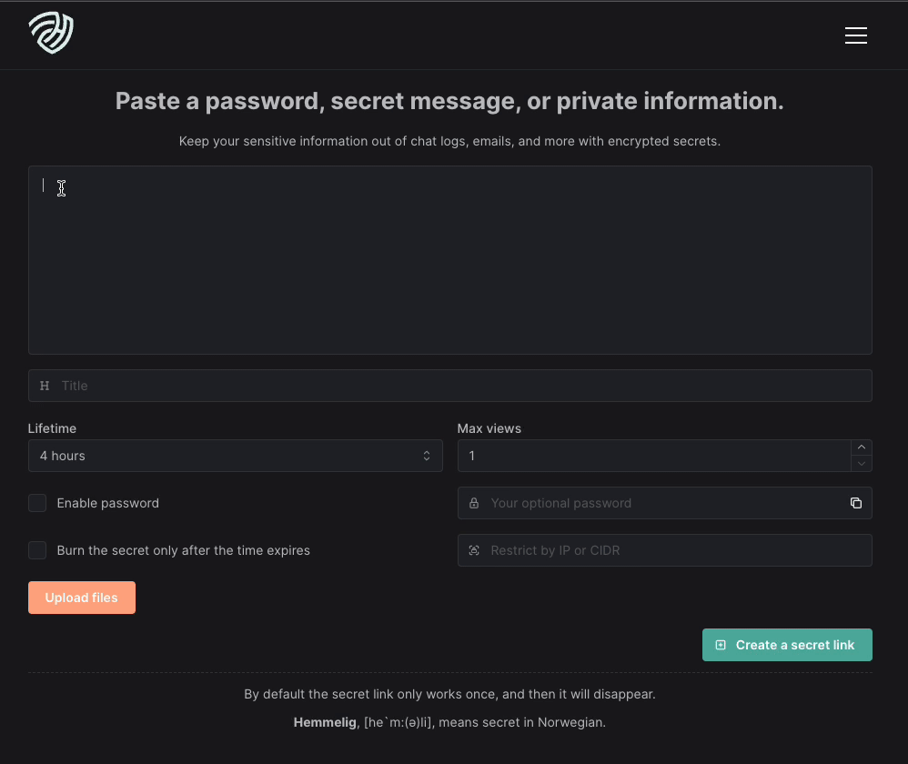

[](https://hub.docker.com/r/hemmeligapp/hemmelig)
[](https://sonarcloud.io/summary/new_code?id=HemmeligOrg_Hemmelig.app)
[](https://betteruptime.com/?utm_source=status_badge)

<div align="center">
  
</div>

<h1 align="center">Free encrypted secret sharing for everyone!</h1>

<div align="center">
  This application is designed for sharing encrypted information across organizations or among private individuals. Hemmelig places a high priority on safeguarding your privacy and will make every effort to maintain it. We trust you will find value in using our product.
</div>

## SaaS

Hemmelig is available at [https://hemmelig.app](https://hemmelig.app)



## How it works

You enter [https://hemmelig.app](https://hemmelig.app), write your sensitive information, expire time, optional password, and click create a secret link. You share the secret link. The receiver of the link opens it, writes the optional password, and retrieves the sensitive information.
When a secret link is created, it gets its unique encryption key that is not saved to the database and only will be part of the URL. This is how the encryption works: `encrypt(DATA, YOUR_UNIQUE_ENCRYPTION_KEY)`. The encryption of the text and files is done in the client; this means the server will get the encrypted information, and nothing in clear text.

## Features

- Client side encryption
- Text formatting and inline image upload (mark the text for the popup)
- Encrypted sensitive information sharing
- Encrypted file upload for signed in users
- Secret lifetime
- Set max views per secret
- Optional encrypted title
- Optional password protection
- Optional IP address restriction
- QR Code of the secret link
- Encrypted key is part of the URL, and not saved to the database for an extra layer of security
- It will detect if the secret is base64 encoded, and add a button to convert it to plain text on read
- Self-hosted version. Keywords: Regulatory compliance
- CLI Support
- Using Prisma with SQLite
- User account
- - Expiration time upgraded to 14 and 28 days
- - File upload
- - List and delete secrets
- Admin settings
- - Disable user registration / sign in
- - Set Hemmelig to be in read only mode by non admin users
- - Disable file upload
- - Disable user account creation
- - Allow organization email domain only for user registration

## Linode Referral

Hemmelig.app is running on Linode, and is not being sponsored by anyone. If you want to support Hemmelig, and use Linode. Here is a referral link that we get free credit if you use. By using this link you will get $100 of credit as well: [https://www.linode.com/lp/refer/?r=a47390eeafc5a46b8e5407a5d2bf28368d474993](https://www.linode.com/lp/refer/?r=a47390eeafc5a46b8e5407a5d2bf28368d474993)

## Docker image

Hemmelig strongly advice you to ue the tagged docker images as the main branch will have breaking changes now and then. For Hemmelig versions supporting Redis, use <= v4.4.0.

Supported docker platforms: `amd/64`, `arm/64`. 

- hemmeligapp/hemmelig:latest (Is created on each version release)
- hemmeligapp/hemmelig:v5.11.3 see [tags](https://github.com/HemmeligOrg/Hemmelig.app/tags) for all version
- hemmeligapp/hemmelig:weekly (pushed every week on Friday)
- hemmeligapp/hemmelig:daily

## Self-hosting

If you have to follow some sort of compliance, and have to self-host, [https://hemmelig.app](https://hemmelig.app) is available as a docker image. The following is the bare minimum to run the docker image.

```bash
mkdir -p data/hemmelig database
chown 1000:1000 data/hemmelig database

docker run -p 3000:3000 -d --name=hemmelig \
   -v ./data/hemmelig/:/var/tmp/hemmelig/upload/files \ # For the file uploads
   -v ./database/:/home/node/hemmelig/database/ \       # For the sqlite database
   hemmeligapp/hemmelig:v5.11.3
```

Alternatively you can use [docker-compose](https://docs.docker.com/compose/):

```bash
# fetch docker-compose.yml
wget https://raw.githubusercontent.com/HemmeligOrg/Hemmelig.app/main/docker-compose.yml

# create volumes directories
mkdir -p data/hemmelig database

# set permissions (Node user has UID 1000 within the container)
chown 1000:1000 data/hemmelig database

# start hemmelig 
docker-compose up -d

# stop containers
docker-compose down
```

Have a look at the Dockerfile for a full example of how to run this application.

## CLI

Hemmelig can be used as a CLI to create secrets on the fly!

```bash
# Pipe data to hemmelig
cat mysecretfile | npx hemmelig

# For the documentaiton
npx hemmelig --help
```

## Environment variables

| ENV vars                      | Description                                                           | Default              |
| ------------------------------|:---------------------------------------------------------------------:| --------------------:|
| `SECRET_LOCAL_HOSTNAME`       | The local hostname for the fastify instance                           | 0.0.0.0              |
| `SECRET_PORT`                 | The port number for the fastify instance                              | 3000                 |
| `SECRET_HOST`                 | Used for i.e. set cors/cookies to your domain name                    | ""                   |
| `SECRET_MAX_TEXT_SIZE`        | The max text size for the secret. Is set in kb. i.e. 256 for 256kb.   | 256                  |
| `SECRET_JWT_SECRET`           | Override this for the secret signin JWT tokens for log in             | good_luck_have_fun   |
| `SECRET_ROOT_USER`            | Override this for the root account username                           | groot                |
| `SECRET_ROOT_PASSWORD`        | This is the root password, override it with your own password         | iamgroot             |
| `SECRET_ROOT_EMAIL`           | This is the root email, override it with your own email               | groot@hemmelig.app   |
| `SECRET_FILE_SIZE`            | Set the total allowed upload file size in mb.                         | 4                    |
| `SECRET_FORCED_LANGUAGE`      | Set the default language for the application.                         | en                   |
| `SECRET_UPLOAD_RESTRICTION`   | Set the restriction for uploads to signed in users                    | "true"               |
| `SECRET_DO_SPACES_ENDPOINT`   | The Digital Ocean Spaces/AWS s3 endpoint                              | ""                   |
| `SECRET_DO_SPACES_KEY`        | The Digital Ocean Spaces/AWS s3 key                                   | ""                   |
| `SECRET_DO_SPACES_SECRET`     | The Digital Ocean Spaces/AWS s3 secret                                | ""                   |
| `SECRET_DO_SPACES_BUCKET`     | The Digital Ocean Spaces/AWS s3 bucket name                           | ""                   |
| `SECRET_DO_SPACES_FOLDER`     | The Digital Ocean Spaces/AWS s3 folder for the uploaded files         | ""                   |
| `SECRET_AWS_S3_REGION`        | The Digital AWS s3 region                                             | ""                   |
| `SECRET_AWS_S3_KEY`           | The Digital AWS s3 key                                                | ""                   |
| `SECRET_AWS_S3_SECRET`        | The Digital AWS s3 secret                                             | ""                   |
| `SECRET_AWS_S3_BUCKET`        | The Digital AWS s3 bucket name                                        | ""                   |
| `SECRET_AWS_S3_FOLDER`        | The Digital AWS s3 folder for the uploaded files                      | ""                   |

## Supported languages

Have a look at the `public/locales/` folder.

## Run locally

```bash
npm install

# Start the frontend/backend
npm run dev
# http://0.0.0.0:3001

```

## Database
Hemmelig has changed from using Redis as an backend to sqlite. Here we are using Prisma, and the sqlite file is available here:
`/database/hemmelig.db`. Have a look at the docker-compose file for how to handle the database.

## Admin, roles and settings
Admins have access to adjust certain settings in Hemmelig. If you go to the account -> instance settings, you can see all the settings.

We also have different roles.
- Admin
- Creator
- User

The difference here is that if you i.e. set Hemmelig to be in read only mode, only `admin` and `creator` is allowed to create secrets, but non signed in users, and users with the role `user` can only view them.

Admins are also allowed to create new users in the settings. This is great if you want to limit who your users are by the `disable user account creation` setting.


## Discord
[Discord](https://discord.gg/NUkvtKdjs7)

## My lovely contributors
<a href="https://github.com/HemmeligOrg/Hemmelig.app/graphs/contributors">
  
</a>

## Contribution

Feel free to contribute to this repository. Have a look at CONTRIBUTION.md for the guidelines.


## Common errors
If this errors occur on the first run of your hemmelig instance, this means there are some issues with the ownership of the files/directory for the database.

```bash
Datasource "db": SQLite database "hemmelig.db" at "file:../database/hemmelig.db"

Error: Migration engine error:
SQLite database error
unable to open database file: ../database/hemmelig.db
```

If you have any issues with uploading files for your instance, you will need the following as well:

Here is an example of how you would solve that:
```bash
sudo chown -R username.group /home/username/data/
sudo chown -R username.group /home/username/database/
```
